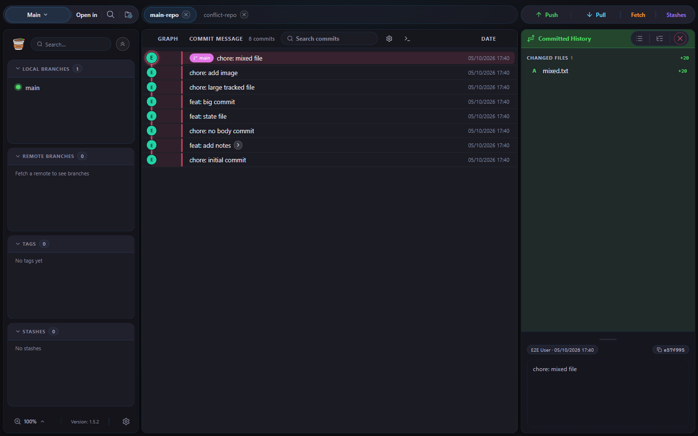
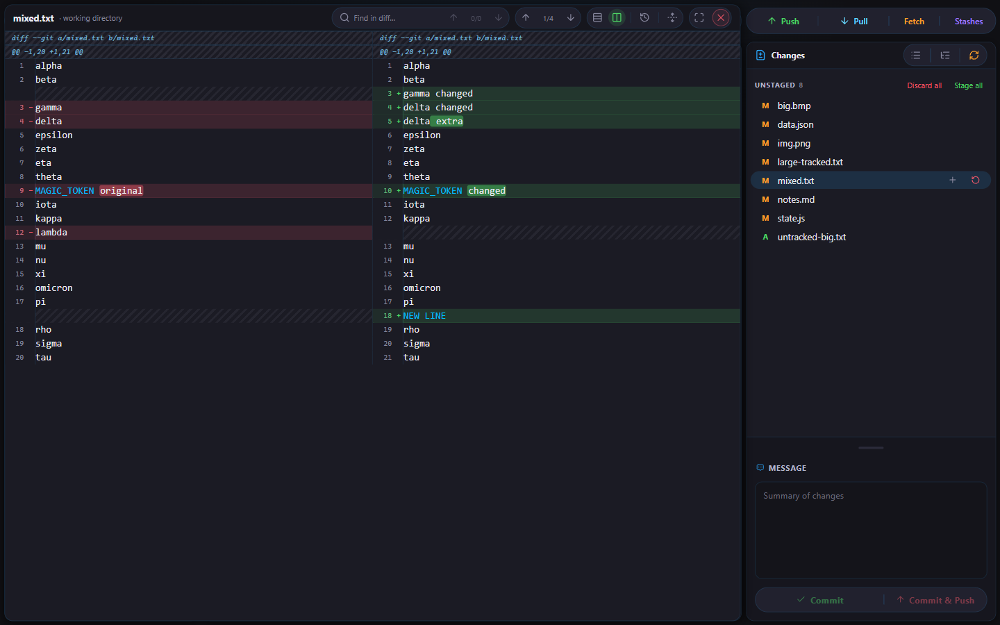
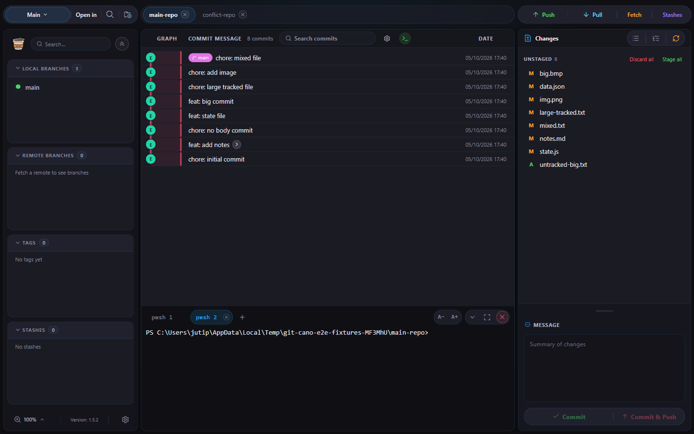
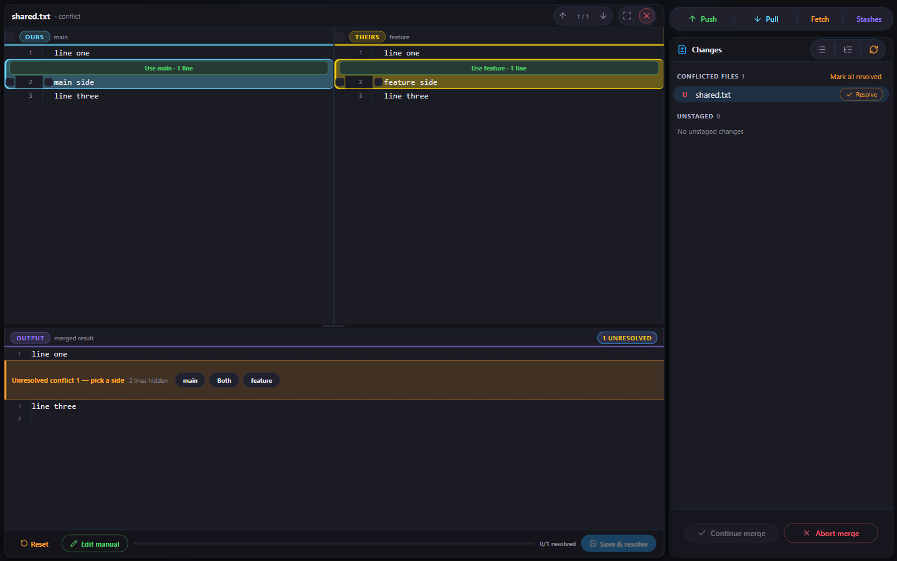
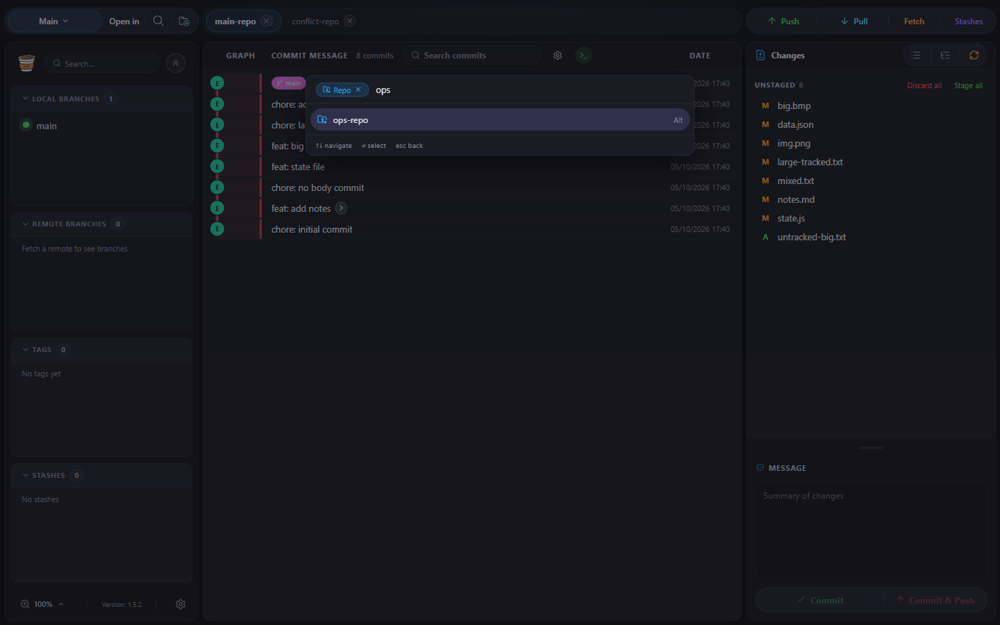
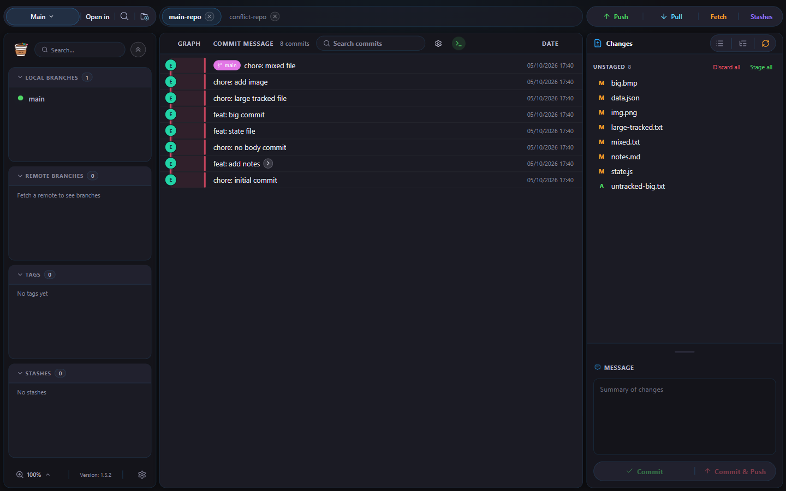
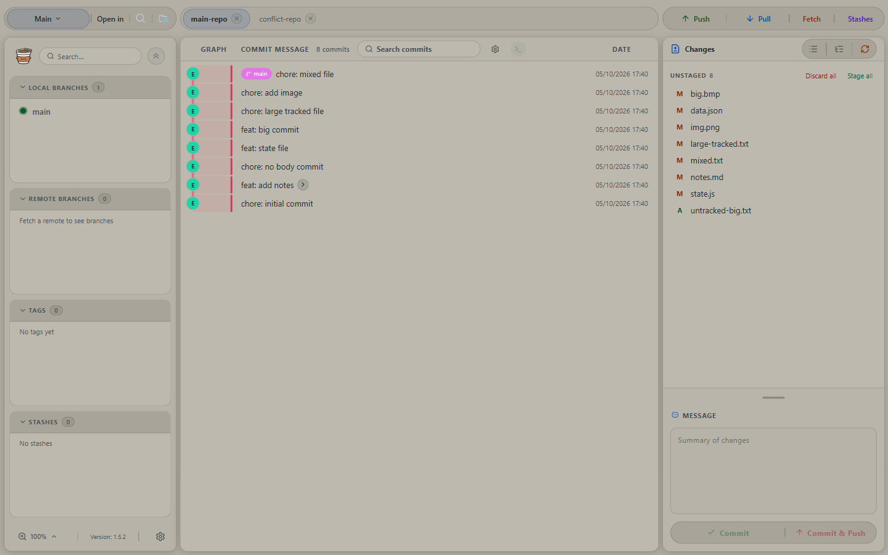
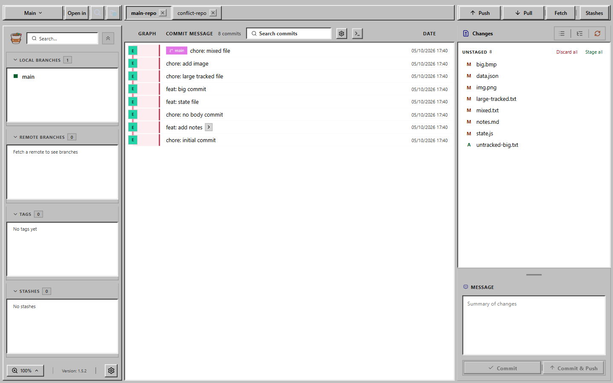
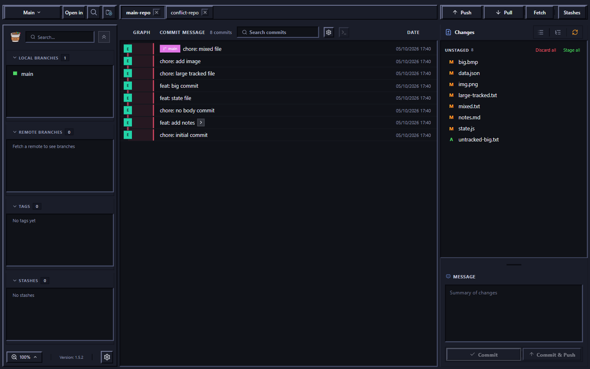

<div align="center">

# 🔀 git-cano

### Everyday Git, without the clutter ✨

A lightweight, open-source Git GUI for **Windows & macOS** — review history 📊, stage changes 🧺, manage branches 🌿, and commit ✅, all in one calm place.

[](https://www.electronjs.org)
[](https://vuejs.org)
[](https://www.typescriptlang.org)
[](https://pnpm.io)

</div>

---

## 📸 Screenshots


| Commit history | Side-by-side diff |
| --- | --- |
|  |  |

| Changes & commit | Terminal panel |
| --- | --- |
|  |  |

| Conflict resolver | Command palette |
| --- | --- |
|  |  |

### 🎨 Themes

| Dark | Light |
| --- | --- |
|  |  |

| Win9x | Win9x Dark |
| --- | --- |
|  |  |

---

## 📥 Install

Download the latest release from **GitHub Releases** (`Jutipong/git-cano`):

- 🪟 **Windows** — `git-cano-<version>-setup.exe`, run the installer (auto-updates in-app). It's unsigned, so SmartScreen may warn → `More info` → `Run anyway`.
- 🍎 **macOS (Apple Silicon only)** — the `.dmg` is unsigned and manual-download (no in-app auto-update):
  1. Open the `.dmg`, drag `Git Cano` into Applications.
  2. Clear the quarantine flag (first install only):
     ```bash
     xattr -cr /Applications/Git\ Cano.app
     ```
  3. Right-click `Git Cano` → Open (only needed once).

## ✨ What can it do?

### 📂 Repositories & Workspaces

|     |                                                                         |
| --- | ----------------------------------------------------------------------- |
| 📁  | Open & clone repositories                                               |
| 🗂️  | Multiple repos open at once as tabs                                     |
| 🧩  | **Workspaces** — group repos, each remembers its own tabs & active repo; drag rows to reorder; switcher button shows text only, no icon |
| 🔎  | **Find a repo in any workspace** — the palette's `Repo…` mode lists every repo open across all workspaces and matches on repo name, full path, or workspace name; picking a repo from another workspace switches there and opens it, with a green **Active** pill on the repo you are actually on. A repo held by several workspaces gets one row per workspace, so you always know which one you will land in |
| ⏳  | **Switch cover** — the splash appears fully opaque the instant you switch (min 1s), so tabs and panels never flicker; clicks pass through while it fades out |
| 💾  | Session & recent-repo restore on startup                                |
| 🔗  | "Open in" text-only button (no chevron) → Folder, Terminal, VS Code (plus Kiro / Visual Studio / Rider when installed) — also in the command palette |
| 🎨  | Catppuccin icons — open menu (`folder-include` + rows `folder-open`/`folder-git`), repo search, Open in Folder/Terminal (`folder`/`bash`); open popup shows instantly, no animation |

### 📊 History & Changes

|     |                                                             |
| --- | ----------------------------------------------------------- |
| 🌌  | Interactive commit graph (custom SVG renderer)              |
| 🏷️  | Hover a commit node — branch/tag chips (tags first, then remote before local per branch), author avatar, email & time |
| ⭕  | Selected commit node — static double ring + soft glow in the lane color, no distracting animation |
| 📏  | Commits with 5+ ref chips get a taller two-line row (chips above the message) |
| 💬  | Full-message popover — subject emphasized with author/date/hash header |
| 🔝  | To-top button — jump back to the top after deep scrolling (commit graph & diff view) |
| 🟢  | Selecting a commit flips the right panel to **Committed History** — green-tinted header & title, clearly distinct from working-dir Changes |
| 🎯  | **Solo a branch** — focus on one branch, unsolo to restore; files the soloed branch never touched fade in Changes |
| 🔍  | Search by message, author, hash, or ref                     |
| 🧺  | Stage/unstage files — or single diff hunks                  |
| ✅  | Commit & amend with a friendly title-length counter — risky actions (commit, revert, rebase, cherry-pick, merge, reset, squash, stash delete) offer timed Undo |
| 🟣  | Squash a HEAD range — `Shift+click` a range in the graph, right-click to squash N into 1 (skipping is impossible by design) |
| ↔️  | Unified / side-by-side diffs with word-level change highlights (marked words use readable text color — add/del rows carry an accent bar), each split pane has its own synced horizontal scrollbar, image diffs, binary detection |
| 👁️  | Preview `.md` (rendered) and `.json` (pretty-printed) — right-click a file or use the **Preview** button in the diff header, read-only in a diff-sized overlay (working tree, a commit's file, or a stash's file) |
| 🕵️  | Blame view & per-file history — hover any line number in the diff for instant authorship (blame lens) |
| 🕰️  | Reflog viewer — timeline of every HEAD move with per-action colors, restore any entry (undoable) |

### 🖥️ Terminal

|     |                                                             |
| --- | ----------------------------------------------------------- |
| ⌨️  | **Built-in terminal panel** under the graph — the toolbar button next to the commit-search settings spawns the repo's first shell (``Ctrl+` `` toggles it, a repo you never opened has no shell at all) |
| 🗂️  | Up to 4 shells per repo, each its own tab (`cmd 1`, `powershell 2`, …) — double-click a tab to rename it, drag tabs to reorder, like repo tabs |
| 🔒  | Shells keep running across repo switches and workspace switches; closing the repo tab closes its shells, and **Terminal: Kill All** (palette command) ends every shell of every repo |
| 🇹🇭  | **Thai renders correctly** — real PTY (node-pty) + xterm 6 DOM renderer with Unicode 11 widths, and Windows shells forced to UTF-8, so `git log`, `pi` and `opencode` output stays aligned instead of turning into mojibake |
| 🔗  | Clickable URLs — **Ctrl/Cmd+click** a printed `http://localhost:3000` (any http(s) link, including OSC 8 hyperlinks) to open it in the OS default browser |
| ⚙️  | Terminal has its own settings — shell (PowerShell 7 by default, Command Prompt, or Windows PowerShell; Windows only, and PowerShell 7 falls back to Command Prompt where it is not installed) and font size, decoupled from the interface font size; `A−`/`A+` in the panel header, hide collapses the panel without ending its shells, and maximize expands it under the repo tab bar |

### 🌿 Branches, Tags & Remotes

|      |                                                        |
| ---- | ------------------------------------------------------ |
| 🌱   | Create / checkout / delete / merge / rebase — right-click a branch to merge it into the current one (or drag a branch onto a branch), drag a commit onto a branch to cherry-pick; cherry-pick and branch merge require a clean worktree; create/switch dialogs remember the local-changes choice |
| 🔀   | **Interactive rebase** — right-click a branch → rebase the current branch onto it, then reorder commits and pick / reword / squash / fixup / edit / drop (reword & squash take a custom message); conflicts and `edit` pauses resolve right in the Changes panel, and finishing offers a timed Undo |
| 🏷️   | Tag create / delete / push — create dialogs share one look with a branch/hash chip in the header, input stays focused on every reopen |
| 🌐   | Remotes: add, edit, test URLs                  |
| ⬇️⬆️ | Fetch / pull / push (SSH key or GitHub token) — buttons show an inline spinner while busy |
| 📦   | Stashes                                                |
| 🧩   | Conflict resolver — per-line picks + manual edit, side buttons show branch/hash, conflicts jump back to Changes |

### 🤖 AI Commit Messages _(optional)_

> 🪄 Let AI write the boring part!

- 🔌 OpenCode Go or OpenRouter providers
- 📋 The model picker lists exactly your **OpenCode Go catalog** — free Go models are badged **Free** (the Zen catalog is never mixed in)
- 📝 Generate from **staged** changes, or auto-commit / auto-commit + push
- 👁️ Commit box shows the active model + auto-commit mode inline (green / orange / red dot, full name in tooltip)
- ⚡ `minimal` reasoning effort = fast responses
- 🧭 OpenCode Go requests identify the session so Go can route and cache them reliably
- 🎨 Optional auto-format before generating

### 🎨 Themes & branding

- 🌑 Dark / Dark Modern / Dark Neon, 💻 Terminal TUI (square corners, scanlines, dusty-navy palette), ☀️ Light
- 🖌️ Commit-graph lane colors adapt per theme
- 🛶 Cano logo in the sidebar toolbar, splash screen & empty state

### 🔔 Calm, non-blocking feedback

- ⏳ Transient toasts auto-dismiss (default **10s**, change it in Settings → General → Notifications) — the dismiss button shows a live **countdown ring** with the digit drawn in the same SVG so it stays centered on Windows & macOS, and hovering a toast pauses its timer.
- 🔴 Failures interrupt with a focused dialog instead of a fleeting toast.
- ↩️ Risky actions (commit, revert, rebase, cherry-pick, merge, reset, squash, stash delete) offer a **timed Undo**.

### 🐇 Feels fast

- ⚡ Local data loads first — the repo is usable immediately
- 🌙 Remote tags load **in the background**, never block you
- 🔄 Workspace switches reuse open repos (no double `git status`)
- 🚀 Cached tab switches paint instantly — the "Loading repository…" overlay only appears when a repo actually needs to reload (150ms delay, 400ms minimum once shown)
- 🌌 Commit graph is virtualized — only the rows on screen are rendered, with taller two-line rows for ref-heavy commits, so huge histories stay smooth
- 🦥 Big repo? Optional `fsmonitor` + untracked cache in Settings → General (Windows only)

## ⌨️ Shortcuts

> 💡 macOS accepts both `⌘` and `Ctrl`. Press <kbd>?</kbd> in the app for the full list!

<details>
<summary><b>Click to expand the cheat sheet 📋</b></summary>

| Action                   | macOS 🍎              | Windows 🪟               |
| ------------------------ | --------------------- | ------------------------ |
| 🔄 Fetch                 | `Ctrl+Shift+↓`        | `Ctrl+Shift+↓`           |
| ⬇️ Pull                  | `Ctrl+↓`              | `Ctrl+↓`                 |
| ⬆️ Push                  | `Ctrl+↑`              | `Ctrl+↑`                 |
| 📁 Open repo             | `Ctrl+O`              | `Ctrl+O`                 |
| 📥 Clone repo            | `Ctrl+N`              | `Ctrl+N`                 |
| ❎ Close tab             | `Ctrl+W`              | `Ctrl+W`                 |
| 🖥️ New terminal tab      | `Ctrl+T`              | `Ctrl+T`                 |
| 🔢 Terminal tab 1…9      | `Ctrl+1…9`            | `Ctrl+1…9`               |
| 🔍 Search commits        | `⌘F`                  | `Ctrl+F`                 |
| ⚙️ Settings              | `Ctrl+,`              | `Ctrl+,`                 |
| ✨ Command palette       | `Ctrl+P` / `Shift×2`  | `Ctrl+P` / `Shift×2`     |
| ⌨️ Show shortcuts        | `?`                   | `?`                      |
| ✅ Commit                | `⌘↵`                  | `Ctrl+↵`                 |
| ❌ Close / cancel        | `Esc`                 | `Esc`                    |
| 🔎 Zoom in / out / reset | `⌘=` / `⌘-` / `⌘0`    | `Ctrl+=` / `Ctrl+-` / `Ctrl+0` |

> ✏️ Fetch, Pull, Push, Open repo, Clone repo, Search commits, Open settings and Command palette are customizable per platform (macOS / Windows) in Settings → Shortcuts (persisted, with a Default button).

</details>

## 🔄 Updates

- **Settings → General → Updates**: pick how often the app checks GitHub Releases (`Off / 1h / 2h / 4h / 6h / 12h / 24h`, default `2h`), or press **Check now** anytime.
- The update icons in the sidebar appear **only when a newer release is found** — an arrow-up icon to download the update, then a restart icon once downloaded (click = restart to install; on macOS and in dev it opens the release page for a manual download).
- 🆕 The **first launch after an update** shows a **What's new** modal with that version's release notes. Reopen it anytime from **Settings → General → Updates → What's new** or the **Window → What's new** menu. Release notes come from the GitHub release body; without a network connection the modal says so instead of failing.

## 🚀 Run from source (developers)

**Need:** [Node.js](https://nodejs.org) 🟢 · [pnpm](https://pnpm.io) 10+ 📦 · Git in `PATH` 🌿

```bash
# 1️⃣ Install dependencies
pnpm install

# 2️⃣ Allow build scripts (first time only)
pnpm approve-builds electron esbuild

# 3️⃣ Run it! (hot reload 🔥)
pnpm dev
```

> 🎉 That's it — pick a repository and start exploring!

## 🛠️ Commands

| Command          | What it does 📌                         |
| ---------------- | --------------------------------------- |
| `pnpm dev`       | 🔥 Dev mode with hot reload             |
| `pnpm build`     | 📦 Production build                     |
| `pnpm typecheck` | 🔍 Type checking (vue-tsc + tsc)        |
| `pnpm lint`      | 🧹 oxlint + vue-tsc                     |
| `pnpm format`    | 💅 Format with oxfmt                    |
| `pnpm dist:mac`  | 🍎 macOS `.dmg` → `release/`            |
| `pnpm dist:win`  | 🪟 Windows Setup `.exe` → `release/` |

## 🗂️ How it's organized

```text
src/
├── 🖥️ main/              # Electron main process + ALL git operations
│   ├── index.ts       #   Window + IPC handlers
│   ├── git.ts         #   Git logic (simple-git)
│   └── opencode.ts    #   AI commit-message generation
├── 🌉 preload/           # Secure window.api bridge
├── 📦 shared/            # Shared types + graph helpers
└── 🎨 renderer/src/
    ├── components/    # Vue SFCs — one per panel / modal / menu
    ├── stores/        # Pinia: repo, workspace, ui, sync, ai, feedback
    ├── utils/         # Formatting, shortcuts, dialogs
    ├── styles.css     # Base styles
    └── modern-ui.css  # Modern UI overrides ✨
```

> 🔒 **Golden rule:** Git never runs in the renderer — everything flows
> `component → window.api → main process → simple-git`.

## 📝 Good to know

- 🌙 Remote tag status needs `origin` + network — it loads in the background on purpose.
- 📦 Releases ship as macOS `.dmg` (arm64) → `release/` via `pnpm dist:mac`, and Windows Setup `git-cano-<version>-setup.exe` via `pnpm dist:win` (NSIS, asar + maximum compression).
- 🍒 Cherry-pick and branch merge check staged, unstaged, and untracked changes first; if any exist, they stop and ask you to stash or commit them manually before retrying. Cherry-pick and drag-to-branch flows use shared safety checks.
- 🔐 Push / pull / fetch / clone keep working even when launched from VS Code or a terminal that exports `GIT_CONFIG_*` / `GIT_SSH_COMMAND` — the app injects its own credentials without tripping simple-git's environment guard.
- 🏷️ A tag and a branch can share a name — tags in the sidebar keep their real name (`backup`, not `tags/backup`), so delete / push / remote-delete always hit the right ref, and branch pull/push refs stay unambiguous.
- 🤖 Building with AI? Read [AGENTS.md](AGENTS.md) first!
